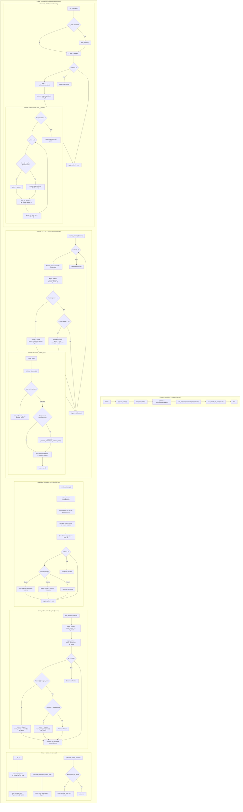

```mermaid
graph TD
    subgraph "Flusso di Esecuzione Principale (main.py)"
        A["main()"] --> B["get_user_config()"];
        B --> C["load_price_data()"];
        C --> D["optimizer = V2GOptimizer(params)"];
        D --> E["run_and_compare_strategies(optimizer)"];
        E --> F["save_results_to_excel(results)"];
        F --> G[Fine];
    end

    subgraph "Classe V2GOptimizer: Dettaglio Implementativo"
        
        subgraph "Metodi di Calcolo Fondamentali"
            INIT["__init__()"] --> INIT1["soc_charge_perc = (P_carica * eff) / C_batt"];
            INIT1 --> INIT2["soc_discharge_perc = (P_scarica / eff) / C_batt"];
            
            COST_DEG["_calculate_degradation_cost(E_kwh)"] --> C_DEG_OUT["return costo_deg_param * |E_kwh|"];
            COST_ANX["_calculate_anxiety_cost(soc)"] --> C_ANX_CHECK{"if soc < soc_min_utente"};
            C_ANX_CHECK -- Sì --> C_ANX_OUT["return penalita * (soc_min - soc)"];
            C_ANX_CHECK -- No --> C_ANX_OUT2["return 0.0"];
        end

        subgraph "Strategia 1: Euristica Semplice (Reattiva)"
            H["run_heuristic_strategy()"] --> H1["soglia_carica = media_prezzi - 0.5 * std_prezzi"];
            H1 --> H2["soglia_scarica = media_prezzi + 0.5 * std_prezzi"];
            H2 --> H_LOOP{"for h in 0..23"};
            H_LOOP --> H_CHECK{"if prezzo[h] < soglia_carica"};
            H_CHECK -- Sì --> H_CARICA["Azione = 'Carica'<br>costo_energia = prezzo[h] * P_carica"];
            H_CHECK -- No --> H_CHECK2{"if prezzo[h] > soglia_scarica"};
            H_CHECK2 -- Sì --> H_SCARICA["Azione = 'Scarica'<br>ricavo_energia = prezzo[h] * P_scarica"];
            H_CHECK2 -- No --> H_ATTESA["Azione = 'Attesa'"];
            H_CARICA --> H_UPDATE["Aggiorna SoC e chiama funzioni di costo"];
            H_SCARICA --> H_UPDATE;
            H_ATTESA --> H_UPDATE;
            H_UPDATE --> H_LOOP;
            H_LOOP -- "Fine" --> H_OUT["DataFrame Risultati"];
        end

        subgraph "Strategia 2: Euristica LCVF (Pianificata V2G)"
            LCVF["run_lcvf_strategy()"] --> LCVF1["sorted_prices = sorted(prices)"];
            LCVF1 --> LCVF2["charge_hours = N ore con prezzo minimo"];
            LCVF2 --> LCVF3["discharge_hours = N ore con prezzo massimo"];
            LCVF3 --> LCVF4["Crea dizionario 'plan{}' per h=0..23"];
            LCVF4 --> LCVF_LOOP{"for h in 0..23"};
            LCVF_LOOP --> LCVF_ACTION{"Azione = plan[h]"};
            LCVF_ACTION -- "'Carica'" --> LCVF_CARICA["costo_energia = prezzo[h] * P_carica"];
            LCVF_ACTION -- "'Scarica'" --> LCVF_SCARICA["ricavo_energia = prezzo[h] * P_scarica"];
            LCVF_ACTION -- "'Attesa'" --> LCVF_ATTESA["Nessuna operazione"];
            LCVF_CARICA --> LCVF_UPDATE["Aggiorna SoC e costi"];
            LCVF_SCARICA --> LCVF_UPDATE;
            LCVF_ATTESA --> LCVF_UPDATE;
            LCVF_UPDATE --> LCVF_LOOP;
            LCVF_LOOP -- "Fine" --> LCVF_OUT["DataFrame Risultati"];
        end

        subgraph "Strategie 3 & 4: MPC (Orizzonte Corto e Lungo)"
            MPC["run_mpc_strategy(horizon)"] --> MPC_LOOP{"for h in 0..23"};
            MPC_LOOP --> MPC1["horizon_prices = prices[h : h+horizon]"];
            MPC1 --> MPC2["action_power = _solve_mpc(soc, horizon_prices, ...)"];
            MPC2 --> MPC_CHECK{"if action_power > 0.1"};
            MPC_CHECK -- Sì --> MPC_CARICA["Azione = 'Carica'<br>power = min(action_power, P_carica)"];
            MPC_CHECK -- No --> MPC_CHECK2{"if action_power < -0.1"};
            MPC_CHECK2 -- Sì --> MPC_SCARICA["Azione = 'Scarica'<br>power = min(-action_power, P_scarica)"];
            MPC_CARICA --> MPC_UPDATE["Aggiorna SoC e costi"];
            MPC_SCARICA --> MPC_UPDATE;
            MPC_CHECK2 -- No --> MPC_UPDATE;
            MPC_UPDATE --> MPC_LOOP;
            MPC_LOOP -- "Fine" --> MPC_OUT["DataFrame Risultati"];
            
            subgraph "Dettaglio Risolutore: _solve_mpc()"
                SOLVER["_solve_mpc()"] --> OBJ["Definisce objective(x)"];
                OBJ --> OBJ_LOOP{"Loop i in 0..horizon-1"};
                OBJ_LOOP --> OBJ_COST["cost_i = f(prezzo_i, x_i, degrado, ansia)"];
                OBJ_LOOP -- "Fine Loop" --> TERM_COST_CHECK{"if is_terminal (orizzonte=24h)"};
                TERM_COST_CHECK -- Sì --> TERM_COST["total_cost += _calculate_terminal_soc_cost(soc_finale)"];
                TERM_COST_CHECK -- No --> MINIMIZE;
                TERM_COST --> MINIMIZE;
                MINIMIZE["res = minimize(objective, ..., method='SLSQP')"];
                MINIMIZE --> RETURN["return res.x[0]"];
            end
        end

        subgraph "Strategia 5: Reinforcement Learning"
            RL["run_rl_strategy()"] --> RL_CHECK_Q{"if 'q_table.npy' esiste"};
            RL_CHECK_Q -- No --> RL_TRAIN["train_rl_agent()"];
            RL_CHECK_Q -- Sì --> RL_LOAD["q_table = np.load(...)"];
            RL_TRAIN --> RL_LOAD;
            RL_LOAD --> RL_LOOP{"for h in 0..23"};
            RL_LOOP --> RL_DISCRETIZE["soc_d = _discretize_soc(soc)"];
            RL_DISCRETIZE --> RL_ACTION["azione = argmax(q_table[h, soc_d])"];
            RL_ACTION --> RL_UPDATE["Aggiorna SoC e costi"];
            RL_UPDATE --> RL_LOOP;
            RL_LOOP -- "Fine" --> RL_OUT["DataFrame Risultati"];

            subgraph "Dettaglio Addestramento: train_rl_agent()"
                TRAIN_EP_LOOP{"for episode in 1..N"};
                TRAIN_EP_LOOP --> TRAIN_H_LOOP{"for h in 0..23"};
                TRAIN_H_LOOP --> TRAIN_EPSILON{"if rand() < epsilon (Esplorazione)"};
                TRAIN_EPSILON -- Sì --> TRAIN_RAND_A["azione = random"];
                TRAIN_EPSILON -- No --> TRAIN_ARGMAX_A["azione = argmax(Q(s)) (Sfruttamento)"];
                TRAIN_RAND_A --> TRAIN_STEP;
                TRAIN_ARGMAX_A --> TRAIN_STEP;
                TRAIN_STEP["new_soc, reward = _get_rl_step_result(...)"];
                TRAIN_STEP --> BELLMAN["Q(s,a) = (1-α)Q + α(R + γ*maxQ')"];
                BELLMAN --> TRAIN_H_LOOP;
                TRAIN_EP_LOOP -- "Fine" --> SAVE_Q["np.save('q_table.npy', q_table)"];
            end
        end
    end
```